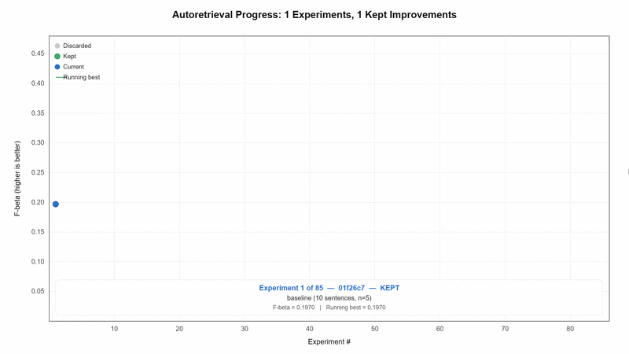

# autoretrieval

[](https://opensource.org/licenses/MIT)
[](https://www.python.org/)
[](https://www.trychroma.com/)
[](https://openrouter.ai/)
[](https://github.com/karpathy/autoresearch)



Give an AI agent a RAG retrieval pipeline and let it experiment autonomously. It edits the pipeline, runs an eval against your own data, checks if F-beta improved, keeps or discards, and repeats. You wake up to a log of experiments and (hopefully) a better retriever.

**Generate eval questions from your own documents**: point `generate_dataset.py` at any corpus and it uses an LLM to produce question/reference-highlight pairs. This makes it possible to optimize a RAG pipeline for your own domain.

Built on techniques from [Karpathy's autoresearch](https://github.com/karpathy/autoresearch), [Chroma's chunking_evaluation](https://github.com/brandonstarxel/chunking_evaluation), and [Andrew Lucek's custom-rag-evals](https://github.com/ALucek/custom-rag-evals). 

## How it works

The repo is deliberately kept small and really has four files that matter:

- **`experiment.py`** - the single file the agent edits. Contains the chunker, embedding model, keyword filtering, and retrieval logic. Everything is fair game. **This file is edited and iterated on by the agent**.
- **`run_eval.py`** - fixed scoring engine. Computes character-level overlap between retrieved chunks and ground-truth reference highlights.
- **`program.md`** — baseline instructions for one agent. Point your agent here and let it go. **This file is edited and iterated on by the human**.
- **`generate_dataset.py`** — generates question/reference-highlight pairs from any corpus. You can use this to create your own evaluation dataset.

By design, the optimization target is **F-beta** (default β=2.0, which favors recall over precision). This means the agent prioritizes capturing relevant text — you can change `F_BETA` in `run_eval.py` to favor precision (β < 1) or be balanced (β = 1.0, the standard F1 score). All metrics are character-level overlap between retrieved chunks and ground-truth highlights, making them independent of your chunking strategy.

## Quick start

**Requirements:** Python 3.10+, an [OpenRouter](https://openrouter.ai/) API key.

```bash
# 1. Clone and install dependencies
git clone https://github.com/daly2211/autoretrieval.git
cd autoretrieval
pip install -r requirements.txt

# 2. Set your API key
cp .env.example .env
# Edit .env and add your OPENROUTER_API_KEY

# 3. Run a single evaluation
python run_eval.py              # full eval
python run_eval.py --pct 10     # 10% sample (quick smoke test)

# 4. Generate a dataset from your own corpus (optional)
python generate_dataset.py      # edit CORPUS and OUTPUT_CSV at top of script first then add the path to your generated dataset to run_eval.py and program.md
```

If the above commands all work ok, your setup is working and you can go into autonomous research mode.

## Running the agent

Simply spin up your Claude/Codex or whatever you want in this repo (and disable all permissions), then you can prompt something like:

```
Have a look at program.md and let's kick off a new experiment
```


## Design choices

- **F-beta as the target.** Default β=2.0 favors recall — the retriever is rewarded for finding relevant text even if it grabs some noise. Change `F_BETA` in `run_eval.py` to tune this tradeoff.
- **Single file to modify.** The agent only touches `experiment.py`. This keeps the scope manageable and diffs reviewable.
- **Self-contained.** Evaluation is pure character-level math on retrieved text. No external services needed at scoring time (only at pipeline construction time for embeddings/keywords).
- **Dataset-agnostic.** Generate questions from any corpus with `generate_dataset.py`. The included `domain_specific_example/` and `general_evaluation_data/` are just examples.

## Credits

Built on techniques and code from:

- [Karpathy's autoresearch](https://github.com/karpathy/autoresearch) 
- [Chroma's chunking_evaluation](https://github.com/brandonstarxel/chunking_evaluation)
- [Andrew Lucek's custom-rag-evals](https://github.com/ALucek/custom-rag-evals)

## License

MIT
